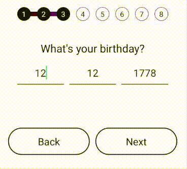

- A react native custom component of a dynamic date input with debounce for the final output and automatic focus for the next input., in typescript.

- It comes with a built-in TypeScript typings and is compatible with all popular JavaScript frameworks. You can use it directly or leverage well-maintained wrapper packages that allow for a more native integration with your frameworks of choice.

# Example:



## How to use:

```
import DateInput from 'react-native-dynamic-date-input';

   <DateInput
        onComplete={(text) => {
          console.log("date ", text);
        }}
      />
```

# DateInput Props -

| Name             | Type                   | Default |
| ---------------- | ---------------------- | ------- |
| onComplete       | (date: string) => void |
| viewStyle?       | ViewStyle              |
| inputStyle?      | ViewStyle              |
| inputDayProps?   | TextInputProps         |
| inputMonthProps? | TextInputProps         |
| inputYearProps?  | TextInputProps         |
| debounceDelay?   | number                 |
| onWrongInput?    | () => void             |
